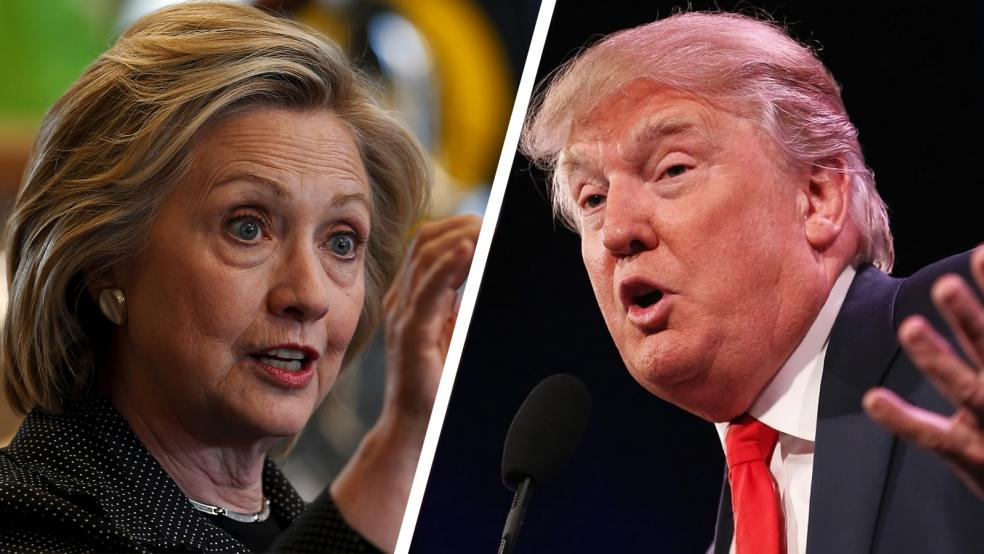
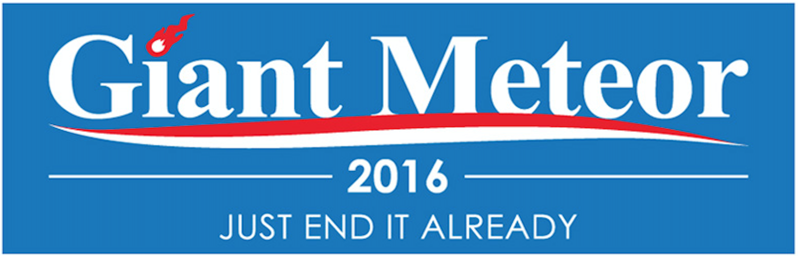

# 2016 Presidential Election Data Hackathon

The [Bay Area WiMLDS Election Data Hackathon](https://www.meetup.com/Bay-Area-Women-in-Machine-Learning-and-Data-Science/events/234866195/) is on Nov 2, 2016.

## Datasets

For convenience, the following datasets from [kaggle.com](https://www.kaggle.com/) and [data.world](https://data.world/) are available in this repository:

- **2016 US Presidential Debate transcripts:** Full transcripts of the face-off between Clinton & Trump
- **Candidate Tweets October 2016:** 30,000+ tweets from the first week of October about the political candidates Trump and Hillary with location data.
- **Hillary Clinton and Donald Trump Tweets:** This dataset provides ~3000 recent tweets from Hillary Clinton and Donald Trump, the two major-party presidential nominees for the 2016 US Presidential Election.
- **Early voting data for the 2016 U.S. Presidential election:** This dataset has the most recent data and will be updated during the early voting period.
- **First GOP Debate Twitter Sentiment:** Tens of thousands of tweets about the early August GOP debate in Ohio. Contributors were asked if the tweet was relevant, which candidate was mentioned, what subject was mentioned, and then what the sentiment was for a given tweet.
- **Funds raised by U.S. presidential candidates for the 2016 election cycle:** Breakdown of funds raised by U.S. presidential candidates for the 2016 election cycle.
- **Hillary Clinton's Emails:** U.S. State Department released nearly 7,000 pages of Clinton's heavily redacted emails
- **Trump vs Staff Tweets:** This dataset provides recent tweets from the [@realDonaldTrump](https://twitter.com/realdonaldtrump) Twitter account, collected by David Robinson.
- **Voter Turnout Rates:** National Voter Turnout Rates, 1787-2012 - The complete time series of national presidential and midterm general election turnout rates from 1787-present.

